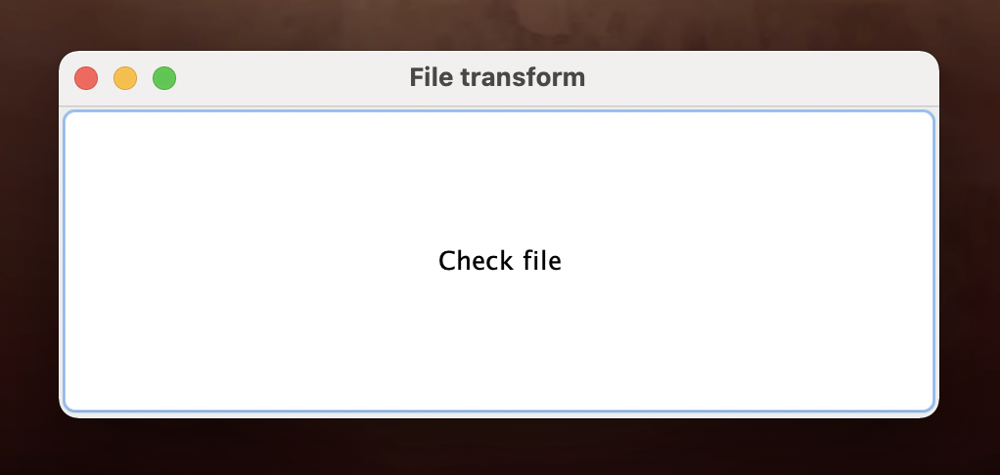
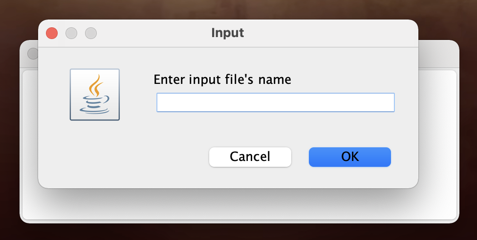
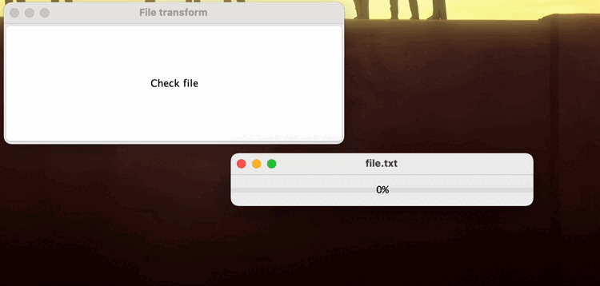
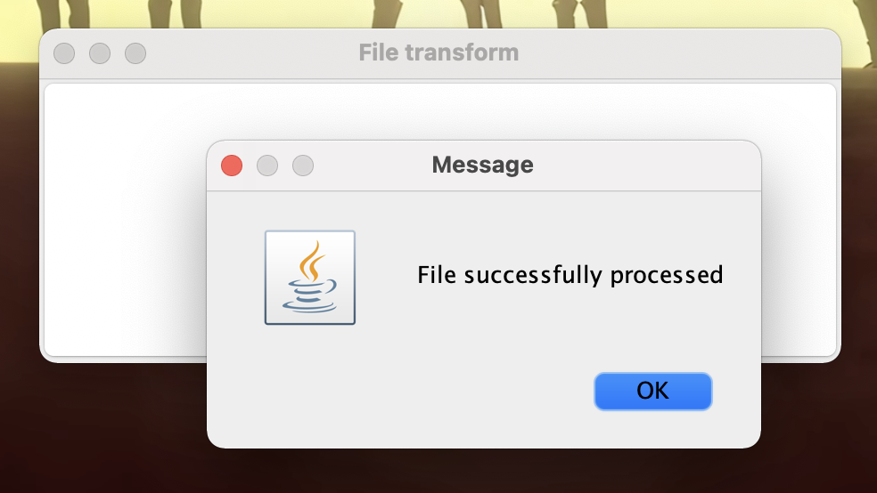
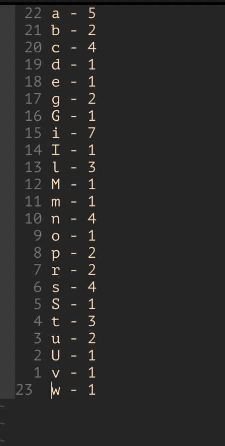

## DevOps lab 1, выполнено на 8-9
* Релизовано приложение на Java, reamde которого приставлено ниже
* Настроена сборка приложения в jar файл

## Вывод количества букв латинского алфавита в файле в другой файл

### Основное окно

### Запрос имен файлов

### Процесс выполнения

### Завершение

### Результат

